# numpy

<p style="color: #303f9f;"><b>In:</b></p>

```python
import numpy as np
np.__version__
```
<p style="color: #d84315;"><b>Out:</b></p>

<pre style="overflow-x:auto; background: #eaeef2; padding-top: 5px">
'1.23.3'</pre>
## numpy数据类型
1. 布尔 bool_
1. 整型 int_/int8.../uint8...
1. 浮点型 float_/float16...
1. 复数型 complex_/complex64...

<p style="color: #303f9f;"><b>In:</b></p>

```python
d1=np.dtype(np.bool_)
d2=np.dtype(np.int_)
d3=np.dtype(np.float_)
d4=np.dtype(np.complex_)

print(d1,d2,d3,d4)
display(d1,d2,d3,d4)
```
<p style="color: #d84315;"><b>Out:</b></p>

<pre style="overflow-x:auto; background: #eaeef2; padding-top: 5px">
bool int32 float64 complex128&#xA;</pre>
<pre style="overflow-x:auto; background: #eaeef2; padding-top: 5px">
dtype('bool')</pre>
<pre style="overflow-x:auto; background: #eaeef2; padding-top: 5px">
dtype('int32')</pre>
<pre style="overflow-x:auto; background: #eaeef2; padding-top: 5px">
dtype('float64')</pre>
<pre style="overflow-x:auto; background: #eaeef2; padding-top: 5px">
dtype('complex128')</pre>
## ndarray类型

<p style="color: #303f9f;"><b>In:</b></p>

```python
# 一维
a1=np.array([1,2,3])
print(f"a1={a1} {type(a1)=}")

# 多维
a2=np.array([[1,2,3], [1,2,3]])
print(f"a2={a2}")

# 指定ndmin最小维度:注意 ndmin 与 ndim 区别
a3=np.array([1,2,3,4,5], ndmin=2)
print(f"a3.ndim={a3.ndim} a3={a3}")

# 指定dtype数据类型
a4=np.array([1,2,3], dtype=complex)
print(f"a4={a4}")
```
<p style="color: #d84315;"><b>Out:</b></p>

<pre style="overflow-x:auto; background: #eaeef2; padding-top: 5px">
a1=[1 2 3] type(a1)=&lt;class 'numpy.ndarray'>&#xA;a2=[[1 2 3]&#xA; [1 2 3]]&#xA;a3.ndim=2 a3=[[1 2 3 4 5]]&#xA;a4=[1.+0.j 2.+0.j 3.+0.j]&#xA;</pre>
## ndarray属性
- ndarray.ndim 矩阵的秩，即轴的数量或维度数
- ndarray.shape 数组的维度，对于矩阵，n 行 m 列
- ndarray.size 数组元素个数, n*m
- ndarray.dtype 元素类型

<p style="color: #303f9f;"><b>In:</b></p>

```python
a=np.arange(12)
print(f"a={a} ndim={a.ndim} shape={a.shape} size={a.size} dtype={a.dtype}")

a=a.reshape(2,3,2)
print(f"after reshape a={a} ndim={a.ndim} shape={a.shape} size={a.size} dtype={a.dtype}")
```
<p style="color: #d84315;"><b>Out:</b></p>

<pre style="overflow-x:auto; background: #eaeef2; padding-top: 5px">
a=[ 0  1  2  3  4  5  6  7  8  9 10 11] ndim=1 shape=(12,) size=12 dtype=int32&#xA;after reshape a=[[[ 0  1]&#xA;  [ 2  3]&#xA;  [ 4  5]]&#xA;&#xA; [[ 6  7]&#xA;  [ 8  9]&#xA;  [10 11]]] ndim=3 shape=(2, 3, 2) size=12 dtype=int32&#xA;</pre>
## 创建数组

<p style="color: #303f9f;"><b>In:</b></p>

```python
# 创建空数组（值未初始化）
print(np.empty(3))

# 创建0填充的数组
print(np.zeros(shape=(1,2), dtype=int))

# 创建1填充的数组
print(np.ones(3))
print(np.ones([2,2], dtype=int))

# 从已有数据创建数组
d1=[1,2,3]
print(np.asarray(d1))

d2=[("a","b","c"),("d","e","f")]
a2=np.asarray(a=d2, dtype="<U1")
print(a2.dtype)
print(a2)

# 从数组范围创建 np.arange(start,stop,step,dtype)
print(np.arange(3))
print(np.arange(0,3,2))
```
<p style="color: #d84315;"><b>Out:</b></p>

<pre style="overflow-x:auto; background: #eaeef2; padding-top: 5px">
[2.07955588e-312 2.12199579e-312 2.16443571e-312]&#xA;[[0 0]]&#xA;[1. 1. 1.]&#xA;[[1 1]&#xA; [1 1]]&#xA;[1 2 3]&#xA;&lt;U1&#xA;[['a' 'b' 'c']&#xA; ['d' 'e' 'f']]&#xA;[0 1 2]&#xA;[0 2]&#xA;</pre>
## 索引(元素访问)

<p style="color: #303f9f;"><b>In:</b></p>

```python
a=np.array([
    [1,2,3],
    [4,5,6],
    [7,8,9]
])
display(a)

# 访问格式:通过行列数组索引访问
# 访问(0,2) (1,1) (2,0)位置元素
rows=[0,1,2]
cols=[2,1,0]
display(a[rows,cols]) # => [3,5,7]

# 访问四个角元素 (0,0) (0,2) (2, 0) (2,2)
# 返回结果是一维数组
rows=[0, 0, 2, 2]
cols=[0, 2, 0, 2]
display(a[rows,cols])
# 返回结果是二维数组
rows=[[0,0],[2,2]]
cols=[[0,2],[0,2]]
display(a[rows, cols])
```
<p style="color: #d84315;"><b>Out:</b></p>

<pre style="overflow-x:auto; background: #eaeef2; padding-top: 5px">
array([[1, 2, 3],&#xA;       [4, 5, 6],&#xA;       [7, 8, 9]])</pre>
<pre style="overflow-x:auto; background: #eaeef2; padding-top: 5px">
array([3, 5, 7])</pre>
<pre style="overflow-x:auto; background: #eaeef2; padding-top: 5px">
array([1, 3, 7, 9])</pre>
<pre style="overflow-x:auto; background: #eaeef2; padding-top: 5px">
array([[1, 3],&#xA;       [7, 9]])</pre>
## 随机函数

<p style="color: #303f9f;"><b>In:</b></p>

```python
# 设定随机种子，这样每次生成的随机数会相同
np.random.seed(123)

# 返回数据在[0,1)之间，具有均匀分布
print(np.random.rand(2,2))

# 返回具有标准正态分布，均值为0，方差为1
print(np.random.randn(2,2))

# 生成随机整数randint(low[,high,size,dtype])，包含low，不包含high
print(np.random.randint(1,10,size=(3,3)))
```
<p style="color: #d84315;"><b>Out:</b></p>

<pre style="overflow-x:auto; background: #eaeef2; padding-top: 5px">
[[0.69646919 0.28613933]&#xA; [0.22685145 0.55131477]]&#xA;[[-0.57860025  1.65143654]&#xA; [-2.42667924 -0.42891263]]&#xA;[[1 4 5]&#xA; [1 1 5]&#xA; [2 8 4]]&#xA;</pre>
# pandas
- https://www.runoob.com/pandas/pandas-tutorial.html
- https://pandas.pydata.org/

<p style="color: #303f9f;"><b>In:</b></p>

```python
import pandas as pd
pd.__version__
```
<p style="color: #d84315;"><b>Out:</b></p>

<pre style="overflow-x:auto; background: #eaeef2; padding-top: 5px">
'1.5.0'</pre>
<p style="color: #303f9f;"><b>In:</b></p>

```python
mydataset = {
    '数据分析': ['numpy', 'pandas', 'matplotlib'],
    'Spark': ['RDD', 'SparkSQL', 'Structured-Streaming']
}
df = pd.DataFrame(mydataset)
df
```
<p style="color: #d84315;"><b>Out:</b></p>


## pandas主要数据结构
- 一维(Series)
    - pandas.Series( data, index, dtype, name, copy)
- 二维(DataFrame)
    - pandas.DataFrame( data, index, columns, dtype, copy)

<p style="color: #303f9f;"><b>In:</b></p>

```python
import numpy as np
import pandas as pd

names = ['a', 'b', 'c', 'd']
ps = pd.Series(names, index=[10, 20, 30, 40])
print(f"{ps=} {type(pd.Series(names))=}")

ps[30]
```
<p style="color: #d84315;"><b>Out:</b></p>

<pre style="overflow-x:auto; background: #eaeef2; padding-top: 5px">
ps=10    a&#xA;20    b&#xA;30    c&#xA;40    d&#xA;dtype: object type(pd.Series(names))=&lt;class 'pandas.core.series.Series'>&#xA;</pre>
<pre style="overflow-x:auto; background: #eaeef2; padding-top: 5px">
'c'</pre>
### 层次索引

#### 列多级

<p style="color: #303f9f;"><b>In:</b></p>

```python
# 显示构造多层索引(使用乘积构造product)
l1 = ["上半年", "下半年"]
l2 = ["收入", "成本", "费用"]
columns = pd.MultiIndex.from_product([l1, l2])
columns

data = np.random.randint(0, 10000, size=(3, 6))
index = ["92#", "95#", "93#"]
df = pd.DataFrame(data=data, index=index, columns=columns)
df
```
<p style="color: #d84315;"><b>Out:</b></p>


#### 行多级

<p style="color: #303f9f;"><b>In:</b></p>

```python
# 行多级
columns = ["python", "java", "c"]
index = pd.MultiIndex.from_product([["期中", "期末"], ["张三", "李四"]])
data = np.random.randint(0, 100, size=(4, 3))
df = pd.DataFrame(data=data, index=index, columns=columns)
df
```
<p style="color: #d84315;"><b>Out:</b></p>


#### 多级访问

<p style="color: #303f9f;"><b>In:</b></p>

```python
df.loc['期中']
```
<p style="color: #d84315;"><b>Out:</b></p>


<p style="color: #303f9f;"><b>In:</b></p>

```python
# 多层级索引使用元祖来表达索引逻辑
df.loc[('期中', '张三')]
```
<p style="color: #d84315;"><b>Out:</b></p>

<pre style="overflow-x:auto; background: #eaeef2; padding-top: 5px">
python     1&#xA;java      83&#xA;c         90&#xA;Name: (期中, 张三), dtype: int32</pre>
#### 多层级索引堆(变形)操作
- stack: 列转行
- unstack: 行转列

<p style="color: #303f9f;"><b>In:</b></p>

```python
display(df)

display(df.unstack())
```
<p style="color: #d84315;"><b>Out:</b></p>


<p style="color: #303f9f;"><b>In:</b></p>

```python
# 从外往里看是0,1,2,3
# 从里往外看是-1,-2,-3
df1 = df.unstack(level=-2)
df1
```
<p style="color: #d84315;"><b>Out:</b></p>


<p style="color: #303f9f;"><b>In:</b></p>

```python
df1.stack(level=-1)
```
<p style="color: #d84315;"><b>Out:</b></p>


## pd.DataFrame创建

### 通过ndarray创建
- 通过ndarray创建pd.DataFrame
- index指定索引
- columns指定列

<p style="color: #303f9f;"><b>In:</b></p>

```python
import numpy as np
import pandas as pd

data=np.random.randint(0,100,size=(3,5))
print(f"{type(data)=} {data.dtype=}")
display(data)

df=pd.DataFrame(data=data,index=list('123'),columns=list('ABCDE'))
df
```
<p style="color: #d84315;"><b>Out:</b></p>

<pre style="overflow-x:auto; background: #eaeef2; padding-top: 5px">
type(data)=&lt;class 'numpy.ndarray'> data.dtype=dtype('int32')&#xA;</pre>
<pre style="overflow-x:auto; background: #eaeef2; padding-top: 5px">
array([[18, 63, 64, 11, 60],&#xA;       [81, 64, 69, 18, 38],&#xA;       [94, 57, 37, 10, 54]])</pre>

### to_excel

<p style="color: #303f9f;"><b>In:</b></p>

```python
df.to_excel('data/pandas/to_excel.xlsx')
df.shape
```
<p style="color: #d84315;"><b>Out:</b></p>

<pre style="overflow-x:auto; background: #eaeef2; padding-top: 5px">
(3, 5)</pre>
### read_excel

<p style="color: #303f9f;"><b>In:</b></p>

```python
df = pd.read_excel('data/pandas/to_excel.xlsx')
df

```
<p style="color: #d84315;"><b>Out:</b></p>


### to_csv
- df.to_string() 不省略显示

<p style="color: #303f9f;"><b>In:</b></p>

```python
import numpy as np
import pandas as pd

data = np.random.randint(0,100,size=(10,2))
df = pd.DataFrame(data)
df
print(df.to_string())
```
<p style="color: #d84315;"><b>Out:</b></p>

<pre style="overflow-x:auto; background: #eaeef2; padding-top: 5px">
    0   1&#xA;0  82  82&#xA;1  44  77&#xA;2  87  45&#xA;3   6  68&#xA;4   3  84&#xA;5  48  87&#xA;6  71  72&#xA;7  58  94&#xA;8  45  37&#xA;9  19  27&#xA;</pre>
### to_sql

<p style="color: #303f9f;"><b>In:</b></p>

```python
import sqlite3
import pandas as pd

conn = sqlite3.connect('data/sqlite3/test.db')

data = np.random.randint(0, 100, size=(10, 2))
df = pd.DataFrame(data)

df.to_sql('test_table', conn, if_exists='replace')

df = pd.read_sql('select * from sqlite_master', conn)
df
```
<p style="color: #d84315;"><b>Out:</b></p>


### read_sql

<p style="color: #303f9f;"><b>In:</b></p>

```python
df = pd.read_sql('select * from test_table', conn)
df
```
<p style="color: #d84315;"><b>Out:</b></p>


## 数据查看

- df.to_string() 不省略显示
- df.head(n) 显示前几行
- df.tail(n) 显示后几行
- df.info() 显示基本信息,包括列名、数据类型、缺失值等
- df.describe() 显示数据的基本统计信息，包括均值、方差、最大值、最小值等
    - 只对可运算的列有效
- df.shape 显示行数与列数
- df.dtypes
- df.values

<p style="color: #303f9f;"><b>In:</b></p>

```python
import numpy as np
import pandas as pd

df = pd.DataFrame(data=np.random.randint(0, 100, size=(10, 2)), columns=['c1', 'c2'])
# display(df)

print(f"{df.info()=}")
print(f"{df.head(2)=}")
print(f"{df.describe()=}")
print(f"{df.shape=}")
```
<p style="color: #d84315;"><b>Out:</b></p>

<pre style="overflow-x:auto; background: #eaeef2; padding-top: 5px">
&lt;class 'pandas.core.frame.DataFrame'>&#xA;RangeIndex: 10 entries, 0 to 9&#xA;Data columns (total 2 columns):&#xA; #   Column  Non-Null Count  Dtype&#xA;---  ------  --------------  -----&#xA; 0   c1      10 non-null     int32&#xA; 1   c2      10 non-null     int32&#xA;dtypes: int32(2)&#xA;memory usage: 208.0 bytes&#xA;df.info()=None&#xA;df.head(2)=   c1  c2&#xA;0  65  77&#xA;1  79  62&#xA;df.describe()=              c1         c2&#xA;count  10.000000  10.000000&#xA;mean   58.700000  62.000000&#xA;std    31.155702  24.828299&#xA;min    11.000000   6.000000&#xA;25%    35.250000  51.500000&#xA;50%    66.500000  66.000000&#xA;75%    82.750000  74.750000&#xA;max    93.000000  98.000000&#xA;df.shape=(10, 2)&#xA;</pre>
### df.dtypes

<p style="color: #303f9f;"><b>In:</b></p>

```python
df.dtypes
```
<p style="color: #d84315;"><b>Out:</b></p>

<pre style="overflow-x:auto; background: #eaeef2; padding-top: 5px">
c1    int32&#xA;c2    int32&#xA;dtype: object</pre>
### df.values

<p style="color: #303f9f;"><b>In:</b></p>

```python
df.values
```
<p style="color: #d84315;"><b>Out:</b></p>

<pre style="overflow-x:auto; background: #eaeef2; padding-top: 5px">
array([[23, 17],&#xA;       [82, 79],&#xA;       [ 3, 57],&#xA;       [12,  4],&#xA;       [59, 99],&#xA;       [33, 18],&#xA;       [27, 44],&#xA;       [45, 12],&#xA;       [52,  4],&#xA;       [54,  7]])</pre>
### df.columns

<p style="color: #303f9f;"><b>In:</b></p>

```python
df.columns
```
<p style="color: #d84315;"><b>Out:</b></p>

<pre style="overflow-x:auto; background: #eaeef2; padding-top: 5px">
Index(['c1', 'c2'], dtype='object')</pre>
### df.items()

<p style="color: #303f9f;"><b>In:</b></p>

```python
for col, val in df.items():
    print('----------------')
    print(col, val)
```
<p style="color: #d84315;"><b>Out:</b></p>

<pre style="overflow-x:auto; background: #eaeef2; padding-top: 5px">
----------------&#xA;c1 0    82&#xA;1    93&#xA;2    24&#xA;3    33&#xA;4    95&#xA;5    16&#xA;6    51&#xA;7    37&#xA;8    69&#xA;9    94&#xA;Name: c1, dtype: int32&#xA;----------------&#xA;c2 0    29&#xA;1    99&#xA;2    99&#xA;3    46&#xA;4    93&#xA;5    44&#xA;6    69&#xA;7    65&#xA;8     2&#xA;9    33&#xA;Name: c2, dtype: int32&#xA;</pre>
### df.index

<p style="color: #303f9f;"><b>In:</b></p>

```python
df.index
```
<p style="color: #d84315;"><b>Out:</b></p>

<pre style="overflow-x:auto; background: #eaeef2; padding-top: 5px">
RangeIndex(start=0, stop=10, step=1)</pre>
## 数据清洗
- 空值的处理
    - df.dropna() 删除包含缺失值的行或列how='all' 'any'
    - df.fillna() 空值填充
- 值替换
    df.replace(old_value, new_value)
- 重复值得处理
    - df.drop_duplicates()删除重复的行
    - df.duplicated() 查看重复的行

### 空值处理 df.dropna()/df.fillna()

<p style="color: #303f9f;"><b>In:</b></p>

```python
import pandas as pd
import numpy as np

df = pd.DataFrame({
    'name': ['numpy', 'pandas', 'matplotlib'],
    'price': [20, 100, 30],
    'remark': [np.NaN, '数据分析', np.NaN]
})
display(df)

df = df.dropna(how='all')
print("after df.dropna(how='all')...")
display(df)
```
<p style="color: #d84315;"><b>Out:</b></p>


<pre style="overflow-x:auto; background: #eaeef2; padding-top: 5px">
after df.dropna(how='all')...&#xA;</pre>

<p style="color: #303f9f;"><b>In:</b></p>

```python
df = df.fillna('')
df
```
<p style="color: #d84315;"><b>Out:</b></p>


### 值替换 df.replace()

<p style="color: #303f9f;"><b>In:</b></p>

```python
df = df.replace('matplotlib', 'MATPLOTLIB')
df
```
<p style="color: #d84315;"><b>Out:</b></p>


### 重复值处理 df.duplicated()/df.drop_duplicates()

<p style="color: #303f9f;"><b>In:</b></p>

```python
result = df.duplicated()
print(type(result))
print(result)

df = df.drop_duplicates()
df
```
<p style="color: #d84315;"><b>Out:</b></p>

<pre style="overflow-x:auto; background: #eaeef2; padding-top: 5px">
&lt;class 'pandas.core.series.Series'>&#xA;0    False&#xA;1    False&#xA;2    False&#xA;dtype: bool&#xA;</pre>

### duplicated()数据查询

<p style="color: #303f9f;"><b>In:</b></p>

```python
df = pd.DataFrame({
    'name': ['spark', 'hadoop', 'hive'],
    'price': [30, 100, 30],
    'remark': ['RDD', 'HDFS', 'SQL']
})
display(df)

# 查询price相同的行
df.loc[df.duplicated(subset=['price'])]
```
<p style="color: #d84315;"><b>Out:</b></p>


### 列值转换 df.column_name.map

<p style="color: #303f9f;"><b>In:</b></p>

```python
df.price = df.price.map(lambda x: x * 2)
df
```
<p style="color: #d84315;"><b>Out:</b></p>


### 列值转换 df.column_name.transform

<p style="color: #303f9f;"><b>In:</b></p>

```python
df.name = df.name.transform(lambda x: x.upper())
df
```
<p style="color: #d84315;"><b>Out:</b></p>


### 重命名 df.rename

<p style="color: #303f9f;"><b>In:</b></p>

```python
# rename函数: 替换索引
# mapper 替换所有索引
# index 替换行索引
# columns 替换列索引
# level 指定多维度索引的维度
df = pd.DataFrame({
    'name': ['spark', 'hadoop', 'hive'],
    'price': [30, 100, 30],
    'remark': ['RDD', 'HDFS', 'SQL']
})
display(df)
df = df.rename(columns={"name": "姓名", 'price': '价格'})

display(df)
df = df.rename(index={0: 'first'})
df
```
<p style="color: #d84315;"><b>Out:</b></p>


### 多维rename

<p style="color: #303f9f;"><b>In:</b></p>

```python
df = pd.concat((df, df), axis=0, keys=["上半年", "下半年"])
df
```
<p style="color: #d84315;"><b>Out:</b></p>


<p style="color: #303f9f;"><b>In:</b></p>

```python
mapper = {
    "上半年": "ONE",
    "下半年": "TWO",
    "first":  "第一"
}

# level指定替换的级别
df = df.rename(mapper=mapper, axis=0, level=-2)
df
```
<p style="color: #d84315;"><b>Out:</b></p>


### 设置行索引df.set_index

<p style="color: #303f9f;"><b>In:</b></p>

```python
df = pd.DataFrame({
    'name': ['spark', 'hadoop', 'hive'],
    'price': [30, 100, 30],
    'remark': ['RDD', 'HDFS', 'SQL']
})
display(df)
df=df.set_index('name')
df
```
<p style="color: #d84315;"><b>Out:</b></p>


## 数据选择与切片
- df[column_name]	选择指定的列
- df.loc[row_index, column_name]	通过标签选择数据
- df.iloc[row_index, column_index]	通过位置选择数据
- df.ix[row_index, column_name]	通过标签或位置选择数据
- df.filter(items=[column_name1, column_name2])	选择指定的列
- df.filter(regex='regex')	选择列名匹配正则表达式的列
- df.sample(n)	随机选择 n 行数据

<p style="color: #303f9f;"><b>In:</b></p>

```python
import pandas as pd
import numpy as np

df = pd.DataFrame({
    'name': ['numpy', 'pandas', 'matplotlib'],
    'price': [20, 100, 30],
    'remark': [np.NaN, '数据分析', np.NaN]
})
display(df)
```
<p style="color: #d84315;"><b>Out:</b></p>


### 通过列名选择
- df[column_name] vs df.column_name

<p style="color: #303f9f;"><b>In:</b></p>

```python
print(f"{type(df['name'])=}\n{df['name']}")

print(f"{type(df.name)=}\n{df.name}")
```
<p style="color: #d84315;"><b>Out:</b></p>

<pre style="overflow-x:auto; background: #eaeef2; padding-top: 5px">
type(df['name'])=&lt;class 'pandas.core.series.Series'>&#xA;0         numpy&#xA;1        pandas&#xA;2    matplotlib&#xA;Name: name, dtype: object&#xA;type(df.name)=&lt;class 'pandas.core.series.Series'>&#xA;0         numpy&#xA;1        pandas&#xA;2    matplotlib&#xA;Name: name, dtype: object&#xA;</pre>
### 通过标签行访问

<p style="color: #303f9f;"><b>In:</b></p>

```python
import pandas as pd
import numpy as np

df = pd.DataFrame(data={
    'name': ['numpy', 'pandas', 'matplotlib'],
    'price': [20, 100, 30],
    'remark': [np.NaN, '数据分析', np.NaN]
}, index=['label1', 'label2', 'label3'])
display(df)

print(type(df.loc['label1']), df.loc['label1'])

print(df.loc[['label1', 'label3']])

print(df.loc['label2':'label3'])
```
<p style="color: #d84315;"><b>Out:</b></p>


<pre style="overflow-x:auto; background: #eaeef2; padding-top: 5px">
&lt;class 'pandas.core.series.Series'> name      numpy&#xA;price        20&#xA;remark      NaN&#xA;Name: label1, dtype: object&#xA;              name  price remark&#xA;label1       numpy     20    NaN&#xA;label3  matplotlib     30    NaN&#xA;              name  price remark&#xA;label2      pandas    100   数据分析&#xA;label3  matplotlib     30    NaN&#xA;</pre>
### 通过位置行访问

<p style="color: #303f9f;"><b>In:</b></p>

```python
df.iloc[0]
```
<p style="color: #d84315;"><b>Out:</b></p>

<pre style="overflow-x:auto; background: #eaeef2; padding-top: 5px">
name      numpy&#xA;price        20&#xA;remark      NaN&#xA;Name: label1, dtype: object</pre>
<p style="color: #303f9f;"><b>In:</b></p>

```python
df.iloc[[0, 1]]
```
<p style="color: #d84315;"><b>Out:</b></p>


<p style="color: #303f9f;"><b>In:</b></p>

```python
df.iloc[0:1]
```
<p style="color: #d84315;"><b>Out:</b></p>


### 元素访问

<p style="color: #303f9f;"><b>In:</b></p>

```python
print(type(df.loc['label1', 'name']))
df.loc['label1', 'name']
```
<p style="color: #d84315;"><b>Out:</b></p>

<pre style="overflow-x:auto; background: #eaeef2; padding-top: 5px">
&lt;class 'str'>&#xA;</pre>
<pre style="overflow-x:auto; background: #eaeef2; padding-top: 5px">
'numpy'</pre>
<p style="color: #303f9f;"><b>In:</b></p>

```python
df.loc['label1'].loc['name']
```
<p style="color: #d84315;"><b>Out:</b></p>

<pre style="overflow-x:auto; background: #eaeef2; padding-top: 5px">
'numpy'</pre>
<p style="color: #303f9f;"><b>In:</b></p>

```python
df.iloc[0, 1]
```
<p style="color: #d84315;"><b>Out:</b></p>

<pre style="overflow-x:auto; background: #eaeef2; padding-top: 5px">
20</pre>
### 标签切片

<p style="color: #303f9f;"><b>In:</b></p>

```python
df['label2':'label3']
```
<p style="color: #d84315;"><b>Out:</b></p>


### 列切片

<p style="color: #303f9f;"><b>In:</b></p>

```python
df.loc[:, 'name':'price']
```
<p style="color: #d84315;"><b>Out:</b></p>


### 行列切片

<p style="color: #303f9f;"><b>In:</b></p>

```python
df.loc['label2':'label3', 'name':'price']
```
<p style="color: #d84315;"><b>Out:</b></p>


## 数据合并
- pd.concat([df1, df2])	将多个数据框按照行或列进行合并
- pd.merge(df1, df2, on=column_name)	按照指定列将两个数据框进行合并

### pd.concat()按列合并

<p style="color: #303f9f;"><b>In:</b></p>

```python
df = pd.DataFrame(data={
    'name': ['numpy', 'pandas', 'matplotlib'],
    'price': [20, 100, 30],
    'remark': [np.NaN, '数据分析', np.NaN]
}, index=['label1', 'label2', 'label3'])

df = pd.concat((df, df), axis=1
               , keys=["上学期", "下学期"]
              )
df
```
<p style="color: #d84315;"><b>Out:</b></p>


### pd.concat()按行合并

<p style="color: #303f9f;"><b>In:</b></p>

```python
df = pd.DataFrame(data={
    'name': ['numpy', 'pandas', 'matplotlib'],
    'price': [20, 100, 30],
    'remark': [np.NaN, '数据分析', np.NaN]
}, index=['label1', 'label2', 'label3'])

df = pd.concat((df, df), axis=0, keys=["上学期", "下学期"])
df
```
<p style="color: #d84315;"><b>Out:</b></p>


### pd.concat() ignore_index忽略索引

<p style="color: #303f9f;"><b>In:</b></p>

```python
import pandas as pd
import numpy as np

columns = ["成本", "费用", "销售额"]
df1 = pd.DataFrame(data=np.random.randint(0, 100, size=(2, 3)), columns=columns)
df2 = pd.DataFrame(data=np.random.randint(0, 100, size=(3, 3)), columns=columns)
display(df1, df2)

# 原始表的索引没有实际意义，可以忽略，避免重复
df = pd.concat((df1, df2),
               ignore_index=True
              )
df
```
<p style="color: #d84315;"><b>Out:</b></p>


### pd.concat() 多级索引

<p style="color: #303f9f;"><b>In:</b></p>

```python
display(df1, df2)

# 如果级联后，原始索引不能忽略，可以使用多级索引
pd.concat((df1, df2), axis=1, keys=["第一季度", "第二季度"])
```
<p style="color: #d84315;"><b>Out:</b></p>


### pd.concat()链接方式outer/inner
- outer链接,外链接，保存链接表的所有字段，缺失补空
- inner链接,内链接，只保留公共字段

<p style="color: #303f9f;"><b>In:</b></p>

```python
df1 = pd.DataFrame(data=np.random.randint(0, 100, size=(1, 5)), columns=list("ABCDE"))
df2 = pd.DataFrame(data=np.random.randint(0, 100, size=(2, 6)), columns=list("BCDEFG"))
display(df1, df2)

# outer链接,外链接，保存链接表的所有字段，缺失补空
# inner链接,内链接，只保留公共字段

pd.concat((df1, df2), join='outer') # 默认方式
```
<p style="color: #d84315;"><b>Out:</b></p>


<p style="color: #303f9f;"><b>In:</b></p>

```python
pd.concat((df1, df2), join='inner')
```
<p style="color: #d84315;"><b>Out:</b></p>


### pd.merge
- merge:
    - how
    - on
    - left_on/right_on
    - suffiexes
    - left_index/right/index

<p style="color: #303f9f;"><b>In:</b></p>

```python
# 合并只和列有关pd.merge
# 合并的两张表一定存在至少一列，在内容上有关系（1对1，1对多,多对多）

tdf = pd.DataFrame(data={
    'tid': ['t1', 't2', 't3'],
    'teacher': ['python老师', 'spark老师', 'hadoop老师']
})

sdf = pd.DataFrame(data={
    'sid': ['s1', 's2', 's3'],
    'student': ['小强', '小红', '小明']
})

cdf = pd.DataFrame(data={
    'cid': ['c1', 'c2', 'c3'],
    'course': ['python', 'spark', 'hadoop']
})

sc_df = pd.DataFrame(data={
    'sid': ['s1', 's1', 's2', 's2', 's3', 's3'],
    'cid': ['c2', 'c3', 'c1', 'c3', 'c1', 'c2'],
})

display(cdf, tdf, sdf, sc_df)
```
<p style="color: #d84315;"><b>Out:</b></p>


### pd.merge on

<p style="color: #303f9f;"><b>In:</b></p>

```python
df = pd.merge(sdf, sc_df, on='sid')
df = pd.merge(df, cdf, on='cid')
df
```
<p style="color: #d84315;"><b>Out:</b></p>


<p style="color: #303f9f;"><b>In:</b></p>

```python
df = df.drop(['sid', 'cid'], axis=1)
df
```
<p style="color: #d84315;"><b>Out:</b></p>


### pd.merge left_on/right_on/suffixes

<p style="color: #303f9f;"><b>In:</b></p>

```python
df = pd.DataFrame(data={
    'tid': ['t1', 't2', 't3'],
    'teacher': ['python老师', 'spark老师', 'hadoop老师']
})

pd.merge(df, df, left_on='tid', right_on='tid', suffixes=['_L1', '_L2'])
```
<p style="color: #d84315;"><b>Out:</b></p>


### np.concatenate级联

<p style="color: #303f9f;"><b>In:</b></p>

```python
import pandas as pd
import numpy as np

a1 = np.ones(shape=(2, 3))
a2 = np.zeros(shape=(4, 3))
display(ar1, ar2)

a = np.concatenate((a1, a2), axis=0)
print(type(a))
a
```
<p style="color: #d84315;"><b>Out:</b></p>

<pre style="overflow-x:auto; background: #eaeef2; padding-top: 5px">
array([[1., 1., 1.],&#xA;       [1., 1., 1.]])</pre>
<pre style="overflow-x:auto; background: #eaeef2; padding-top: 5px">
array([[0., 0., 0.],&#xA;       [0., 0., 0.],&#xA;       [0., 0., 0.],&#xA;       [0., 0., 0.]])</pre>
<pre style="overflow-x:auto; background: #eaeef2; padding-top: 5px">
&lt;class 'numpy.ndarray'>&#xA;</pre>
<pre style="overflow-x:auto; background: #eaeef2; padding-top: 5px">
array([[1., 1., 1.],&#xA;       [1., 1., 1.],&#xA;       [0., 0., 0.],&#xA;       [0., 0., 0.],&#xA;       [0., 0., 0.],&#xA;       [0., 0., 0.]])</pre>
## 数据分组与聚合
- df.groupby(column_name)	按照指定列进行分组
- df.aggregate(function_name)	对分组后的数据进行聚合操作
- df.pivot_table(values, index, columns, aggfunc)	生成透视表

### df.groupby

<p style="color: #303f9f;"><b>In:</b></p>

```python
df = pd.DataFrame(data={
    'student': ['小强', '小红', '小明', '小强', '小红', '小明', '小强', '小红', '小明'],
    'course': ['python', 'python', 'python', 'spark', 'spark', 'spark', 'hadoop', 'hadoop', 'hadoop'],
    'score': np.random.randint(60,100, size=9)
})
display(df)

groupDF = df.groupby('student')
print(f"{type(groupDF)=}")
display(groupDF)

# 查看分组对象的信息
print(f"{type(groupDF.groups)=},{groupDF.groups=}")
for g in groupDF.groups:
    print(f"{type(g)=},{g=}")

for DF in groupDF:
    print(f"{type(DF)=},{DF=}")
```
<p style="color: #d84315;"><b>Out:</b></p>


<pre style="overflow-x:auto; background: #eaeef2; padding-top: 5px">
type(groupDF)=&lt;class 'pandas.core.groupby.generic.DataFrameGroupBy'>&#xA;</pre>
<pre style="overflow-x:auto; background: #eaeef2; padding-top: 5px">
&lt;pandas.core.groupby.generic.DataFrameGroupBy object at 0x0000020F5F360190></pre>
<pre style="overflow-x:auto; background: #eaeef2; padding-top: 5px">
type(groupDF.groups)=&lt;class 'pandas.io.formats.printing.PrettyDict'>,groupDF.groups={'小强': [0, 3, 6], '小明': [2, 5, 8], '小红': [1, 4, 7]}&#xA;type(g)=&lt;class 'str'>,g='小强'&#xA;type(g)=&lt;class 'str'>,g='小明'&#xA;type(g)=&lt;class 'str'>,g='小红'&#xA;type(DF)=&lt;class 'tuple'>,DF=('小强',   student  course  score&#xA;0      小强  python     65&#xA;3      小强   spark     97&#xA;6      小强  hadoop     84)&#xA;type(DF)=&lt;class 'tuple'>,DF=('小明',   student  course  score&#xA;2      小明  python     78&#xA;5      小明   spark     62&#xA;8      小明  hadoop     65)&#xA;type(DF)=&lt;class 'tuple'>,DF=('小红',   student  course  score&#xA;1      小红  python     84&#xA;4      小红   spark     77&#xA;7      小红  hadoop     75)&#xA;</pre>
<p style="color: #303f9f;"><b>In:</b></p>

```python
avgDF = pd.DataFrame(data=groupDF.score.mean())
avgDF
```
<p style="color: #d84315;"><b>Out:</b></p>


<p style="color: #303f9f;"><b>In:</b></p>

```python
maxDF = pd.DataFrame(data=groupDF.score.max())
maxDF
```
<p style="color: #d84315;"><b>Out:</b></p>


<p style="color: #303f9f;"><b>In:</b></p>

```python
df1 = pd.merge(df, avgDF, left_on="student", right_index=True, suffixes=["_学生", "_均值"])
df1
df2 = pd.merge(df1, maxDF, left_on="student", right_index=True)
df2
```
<p style="color: #d84315;"><b>Out:</b></p>


### df.agg

<p style="color: #303f9f;"><b>In:</b></p>

```python
groupDF.groups
```
<p style="color: #d84315;"><b>Out:</b></p>

<pre style="overflow-x:auto; background: #eaeef2; padding-top: 5px">
{'小强': [0, 3, 6], '小明': [2, 5, 8], '小红': [1, 4, 7]}</pre>
<p style="color: #303f9f;"><b>In:</b></p>

```python
groupDF.agg({"score": ["mean", "max", "min"]})
```
<p style="color: #d84315;"><b>Out:</b></p>


## 数据排序
- df.sort_values(column_name)	按照指定列的值排序
- df.sort_values([column_name1, column_name2], ascending=[True, False])	按照多个列的值排序
- df.sort_index()	按照索引排序

<p style="color: #303f9f;"><b>In:</b></p>

```python
df = pd.DataFrame(data=np.random.randint(0, 100, 5), columns=['score'])
df.sort_values('score', ascending=False)
df.sort_index(ascending=False)
```
<p style="color: #d84315;"><b>Out:</b></p>


# matplotlib
- 参考文档
    - [matplotlib官网](https://matplotlib.org/stable/tutorials/index.html)
    - [matplotlib 菜鸟教程](https://www.runoob.com/matplotlib/matplotlib-tutorial.html)

## matplotlib绘图标记
1. fmt参数,fmt 参数定义了基本格式，如标记、线条样式和颜色
      - fmt = '[marker][line][color]',如o:r，o 表示实心圆标记，: 表示虚线，r 表示颜色为红色
1. 标记大小与颜色
      - markersize，简写为 ms：定义标记的大小
      - markerfacecolor，简写为 mfc：定义标记内部的颜色
      - markeredgecolor，简写为 mec：定义标记边框的颜色

<p style="color: #303f9f;"><b>In:</b></p>

```python
import matplotlib
import matplotlib.pyplot as plt
matplotlib.__version__
```
<p style="color: #d84315;"><b>Out:</b></p>

<pre style="overflow-x:auto; background: #eaeef2; padding-top: 5px">
'3.6.0'</pre>
## line

### 直线

<p style="color: #303f9f;"><b>In:</b></p>

```python
from matplotlib import pyplot as plt

x = np.arange(1, 11)
y = 2 * x + 5
plt.title("Line")
plt.xlabel("x axis")
plt.ylabel("y axis")
plt.plot(x, y)
plt.show()

# 只绘制坐标点
plt.plot(x, y, 'o')
plt.show()
```
<p style="color: #d84315;"><b>Out:</b></p>

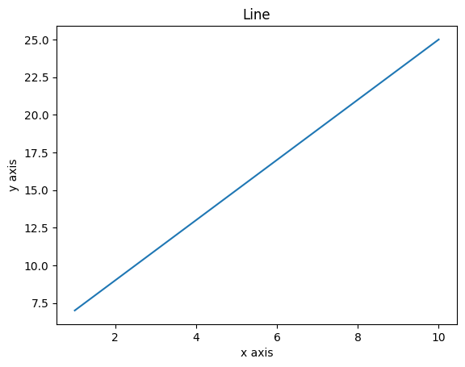
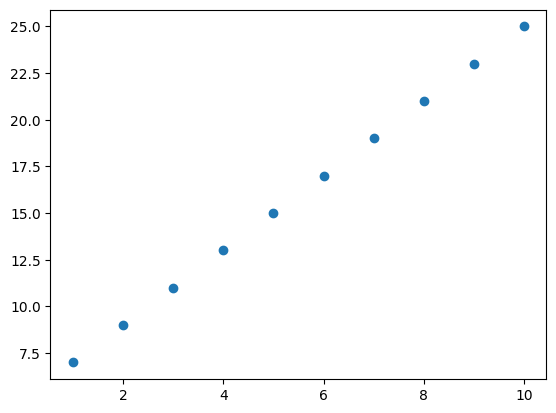
### 折线

<p style="color: #303f9f;"><b>In:</b></p>

```python
# 绘制折线
x=np.array([1,2,6,8,10])
y=np.array([7,3,9,4,8])
plt.plot(x,y)
plt.show()
```
<p style="color: #d84315;"><b>Out:</b></p>

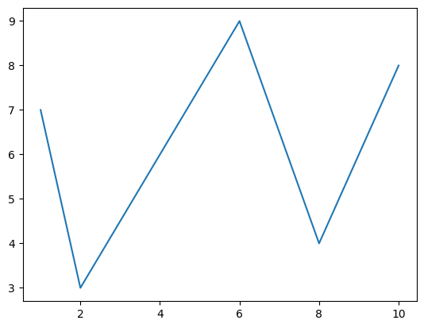
### 不指定x轴的点

<p style="color: #303f9f;"><b>In:</b></p>

```python
# 不指定x轴的点,x轴默认值[0,1]
y=np.array([1,500])
plt.plot(y)
plt.show()
```
<p style="color: #d84315;"><b>Out:</b></p>

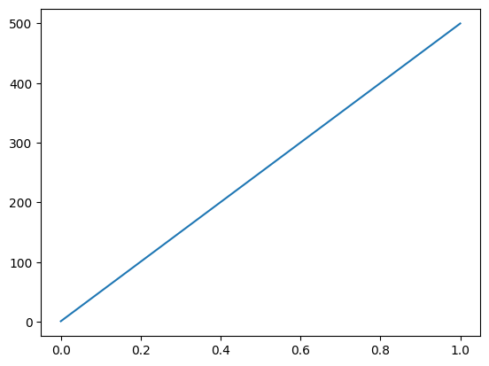
<p style="color: #303f9f;"><b>In:</b></p>

```python
# 不指定x轴的点,x轴默认值[0, 1, 2, 3, 4, 5]
y=np.array([8,6,9,3,7,1])
plt.plot(y)
plt.show()
```
<p style="color: #d84315;"><b>Out:</b></p>

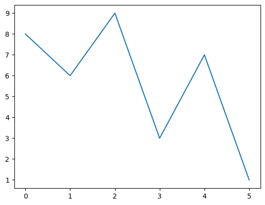
### 正弦/余弦绘图

<p style="color: #303f9f;"><b>In:</b></p>

```python
# 正弦/余弦绘图
x=np.arange(0, 4*np.pi, 0.1) # start,stop,step
y=np.sin(x)
z=np.cos(x)
plt.plot(x,y,x,z)
plt.show()
```
<p style="color: #d84315;"><b>Out:</b></p>

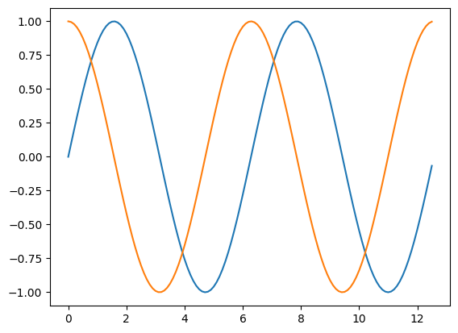
### 绘图标记

<p style="color: #303f9f;"><b>In:</b></p>

```python
y=np.array([1,3,7,9])
plt.plot(y, marker='o')
plt.show()

plt.plot(y, "o:r")
plt.show()
```
<p style="color: #d84315;"><b>Out:</b></p>

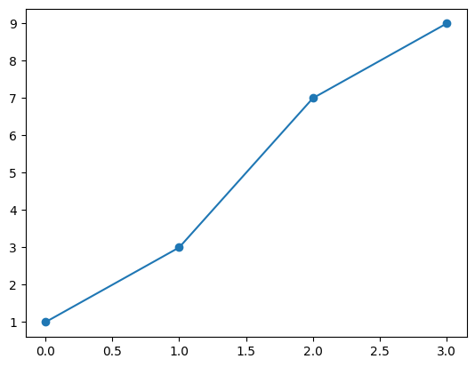
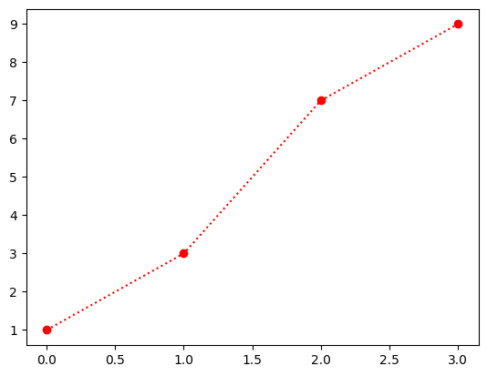
### 案例-多任务耗时图

<p style="color: #303f9f;"><b>In:</b></p>

```python
import pandas as pd

df = pd.DataFrame(data=[
    ['2020-09-01', 'task1', 50],
    ['2020-09-02', 'task1', 55],
    ['2020-09-03', 'task1', 48],
    ['2020-09-04', 'task1', 88],
    ['2020-09-01', 'task2', 46],
    ['2020-09-02', 'task2', 60],
    ['2020-09-03', 'task2', 53],
    ['2020-09-04', 'task2', 99],
], columns=["runDate", "task", "spentTime"])

# 设置pandas.DataFrame index并对数据按runDate列进行排序
df = df.set_index("runDate").sort_values(by=["runDate"])
display(df)

# 获取索引列值数组
x = df.index.drop_duplicates().to_list()

# 按task列进行分组
gdf=df.groupby("task")

# 按spentTime列作为y抽的值进行折线图绘图
gdf["spentTime"].plot(marker='o', figsize=(6,3), legend=True)

# 设置x轴的标签显示间隔、标签值、标签旋转度
plt.xticks(ticks=[i for i in range(len(x))], labels=x, rotation=30)

plt.show()
```
<p style="color: #d84315;"><b>Out:</b></p>


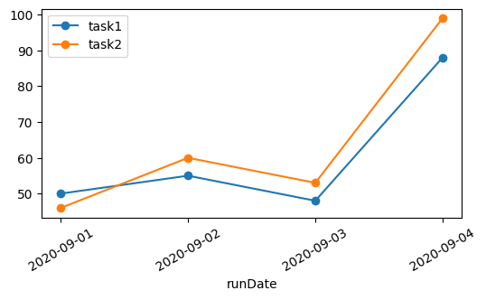
## bar

<p style="color: #303f9f;"><b>In:</b></p>

```python
from matplotlib import pyplot as plt

x = [5, 8, 10]
y = [12, 16, 6]
x2 = [6, 9, 11]
y2 = [6, 15, 7]
plt.bar(x, y, align='center')
plt.bar(x2, y2, color='g', align='center')
plt.title('Bar')
plt.ylabel('y axis')
plt.xlabel('x axis')
plt.show()
```
<p style="color: #d84315;"><b>Out:</b></p>

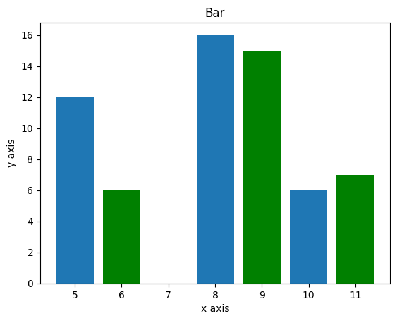
## hist

<p style="color: #303f9f;"><b>In:</b></p>

```python
# 数据的频率分布的图
a = np.array([22,87,5,43,56,73,55,54,11,20,51,5,79,31,27]) 
# a=np.random.randint(0,100, 30)
plt.hist(a, bins =  [0,20,40,60,80,100]) 
# plt.hist(a)
plt.title("histogram") 
plt.show()
```
<p style="color: #d84315;"><b>Out:</b></p>

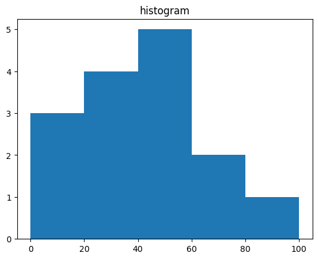