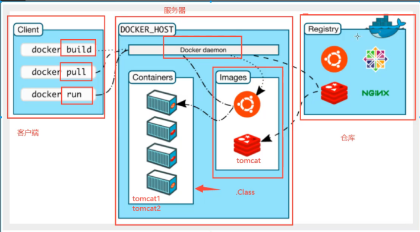
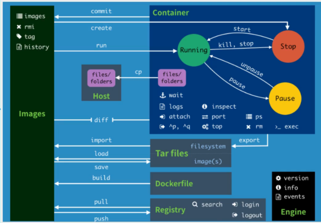
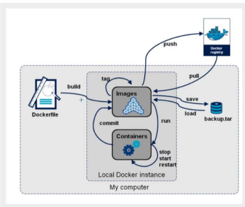

## 参考
- [B站视频](https://www.bilibili.com/video/BV1og4y1q7M4?from=search&seid=3874135174184566929)

## 介绍
> docker架构图


> docker三要素
镜像、容器、仓库

## 安装

- [安装教程](https://www.runoob.com/docker/centos-docker-install.html)
- 资源所在目录 /var/lib/docker

## docker命令


### 帮助命令
```bash
docker version #查看版本
docker info #查看docker的系统信息，包括镜像、容器
docker --help #帮助命令
docker container --help #查看容器帮助命令
```
### 镜像命令
```bash
docker images #查看本地所有镜像

docker search xxx #远程镜像搜索命令
docker search -f STARS=80 konga #搜索STARS>=80的konga
docker search konga

docker pull xxx #下载镜像，默认下载最新的tag版本，且是分层下载（联合文件下载）

docker rmi -f xxx #删除镜像，-f 强制删除
docker rmi -f $(docker images -aq) #将docker images -aq的所有image_id当参数传给docker rmi
```

### 容器命令
下载一个centos学习使用docker pull centos
```bash
# 新建容器并启动
docker run [option] image
--name="xxx" #给容器命名
-d  #后台运行
-it #使用交互方式，进入容器查看内容
-p  #指定容器的端口 -p 8080(主机端口):8080(容器端口)：
       -p ip:主机端口:容器端口
       -p 主机端口:容器端口 （常用）
       -p 容器端口
       容器端口
-P #随机指定容器端口

# 交互式运行centos,并指定控制台/bin/bash
docker run -it centos /bin/bash
[root@d8b70485818f /]# ls
bin  dev  etc  home  lib  lib64  lost+found  media  mnt  opt  proc  root  run  sbin  srv  sys  tmp  usr  var

# 查看容器
docker ps #查看正在运行的容器
docker ps -a #查看所有运行过的容器
docker ps -aq -n 2 #显示最近两个运行的的容器id

# 进入容器后exit会退出容器并停止运行
ctrl+p+q 退出但不停止运行

# 查看容器
docker container ls -a #查看所有容器

# 删除容器
docker rm
docker rm -f $(docker ps -qa)
docker ps -a -q | xargs docker rm

# 启动、停止、重启、强制停止容器
docker start xxx
docker restart xxx
docker stop xxx
docker kill xxx

# docker -d启动后，centos停止了！
常见的坑：docker使用后台运行，必须有一个前台进程，docker发现前台没有应用了，就会自动停止
docker run -d centos
b03e6e1d01233a543cb97f5e5095e722961ed3f1b8ae7de570bcd2365303e81b

docker ps
CONTAINER ID   IMAGE     COMMAND   CREATED   STATUS    PORTS     NAMES

docker ps -a
CONTAINER ID   IMAGE     COMMAND       CREATED              STATUS                          PORTS     NAMES
b03e6e1d0123   centos    "/bin/bash"   14 seconds ago       Exited (0) 13 seconds ago                 youthful_spence
aaf730bd9c3c   centos    "/bin/bash"   About a minute ago   Exited (0) About a minute ago             mc
```

### 查看日志docker logs
```bash
docker logs -f -t --tail 容器
docker run -d --name md centos /bin/sh -c "while true; do echo haha;sleep 1;done"
docker logs -f -t --tail 10 md
2021-02-16T05:07:31.979794802Z haha
2021-02-16T05:07:32.983512595Z haha
```

### 查看进程docker top
```bash
docker top md
UID                 PID                 PPID                C                   STIME               TTY                 TIME                CMD
root                84372               84352               0                   00:07               ?                   00:00:00            /bin/sh -c while true; do echo haha;sleep 1;done
root                85038               84372               0                   00:10               ?                   00:00:00            /usr/bin/coreutils --coreutils-prog-shebang=sleep /usr/bin/sleep 1

ps -ef|gep 84372
-bash: gep: command not found

ps -ef|grep 84372
root      84372  84352  0 00:07 ?        00:00:00 /bin/sh -c while true; do echo haha;sleep 1;done
root      85122  84372  0 00:11 ?        00:00:00 /usr/bin/coreutils --coreutils-prog-shebang=sleep /usr/bin/sleep 1
root      85130  79902  0 00:11 pts/0    00:00:00 grep --color=auto 84372
```

### 查看容器的元数据docker inspect
```bash
docker inspect md
```

### 进入当前正在运行的容器
```bash
# 方式一:
docker exec -it xxx shell
docker exec -it md /bin/bash

# 方式二:
docker attach xxx
```

> docker exec 与 attach区别：exec开启新的终端, attach进入真在执行的终端

### 从容器内复制文件到主机
```bash
docker cp mc:/test.java .
```

## 案例
### docker安装nginx
```bash
docker search nginx
docker run -d -p3344:80 --name nginx nginx
```

### dockery安装tomcat
```bash
docker run -d --name tomcat01 -p3355:8080 tomcat:9.0
tomcat是纯净版的，里面没有部署项目，可将里面的webapps.dist复制到webapps下做测试
docker exec -it tomcat01 /bin/bash
```

## portainer GUI工具

## docker镜像讲解
### 分层原理
bootfs,rootfs,unionfs

### docker commit

## 容器数据卷
```bash
# 方式一：使用命令行 -v方式

docker run -it --name mc -v /root/test/dockerv:/home centos /bin/bash
将docker内/home挂着到主机/root/test/dockerv目录
```

### 实战：安装mysql挂载数据
### 具名与匿名挂载
- 查看所有的volume情况
```bash
docker volume ls
```

- 具名挂载
```bash
docker run -d -P -v myname:/etc/nginx nginx
```

### 初识Dockerfile挂载
#### 编写dockerfile
```
cat dockerfile1 
FROM centos
VOLUME ["volume01", "volume02"]
CMD echo "------------end-------------"
CMD /bin/bash
```
#### 生成镜像

## dockerfile

## docker全流程总结

